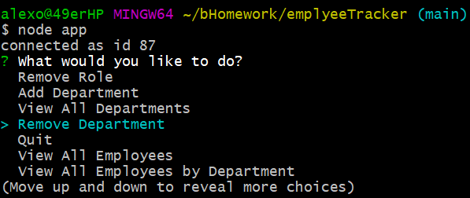
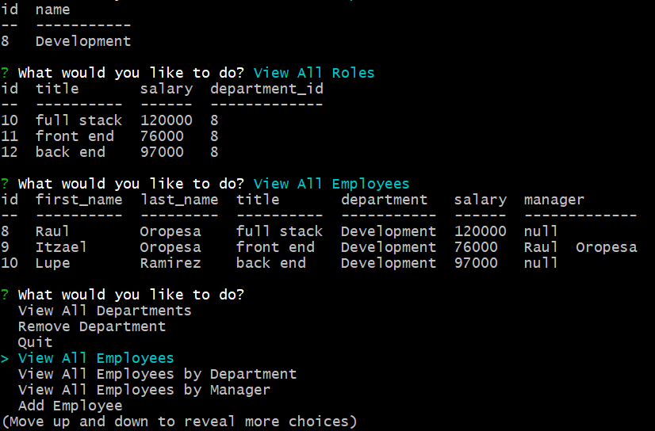
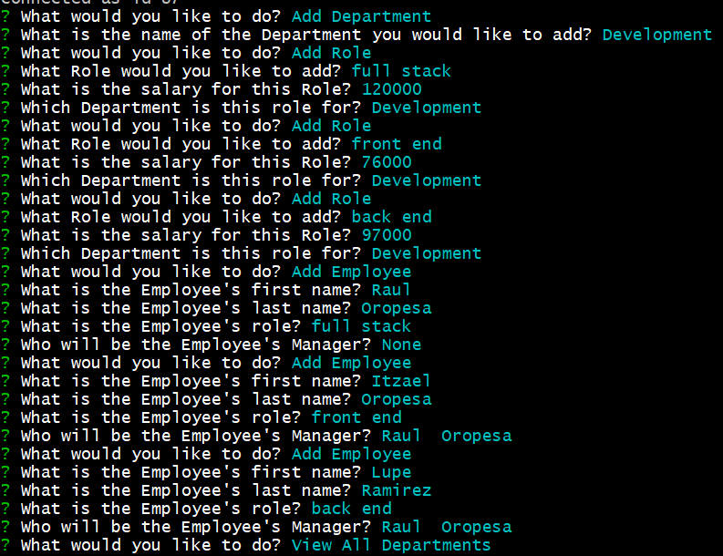
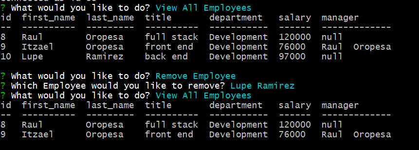
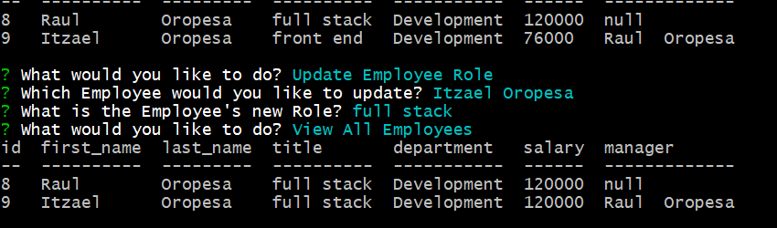

# Employee Tracker

## Description

---

This CLI can be used to input Employee information, remove information, and update infromation. This is the perfect tool to keep track of all of your Employees.

## Table of content

---

- [Description](#description)
- [Table of contents](#table-of-content)
- [Installation](#installation)
- [Setup](#setup)
- [Contributing](#contributing)
- [Support/Questions](#supportquestions)
- [License](#license)

## Installation

---

> **_get started_**:

- node js
- inquirer
- console.table

## Setup

---

- npm install
- npm i inquirer
- npm i mysql
- npm i console.table --save

---

---

---

---

---

---

> **_Find me on Github:_**

**_At Github:_**
<https://github.com/Rauloropesa3/emplyeeTracker.git>

**_Check out the Employee tracker CLI Video_**
<https://drive.google.com/file/d/1mNiHPiCY5DaxB76Whec5iXRHCV-vu5Z9/view>

## Contributing

---

**_step 1_**

- **Option 1**

  - Fork this repo!

- **Option 2**
  - Clone thr repo to your local machine

**_step 2_**

- Hack Away!!!
- Create a new pull request

## Support/Questions

---

Reach out to me if you have any questions!

- Via email:
  - alexoropes1982@yahoo.com

## License

---

- MIT License

  <https://opensource.org/license/>
